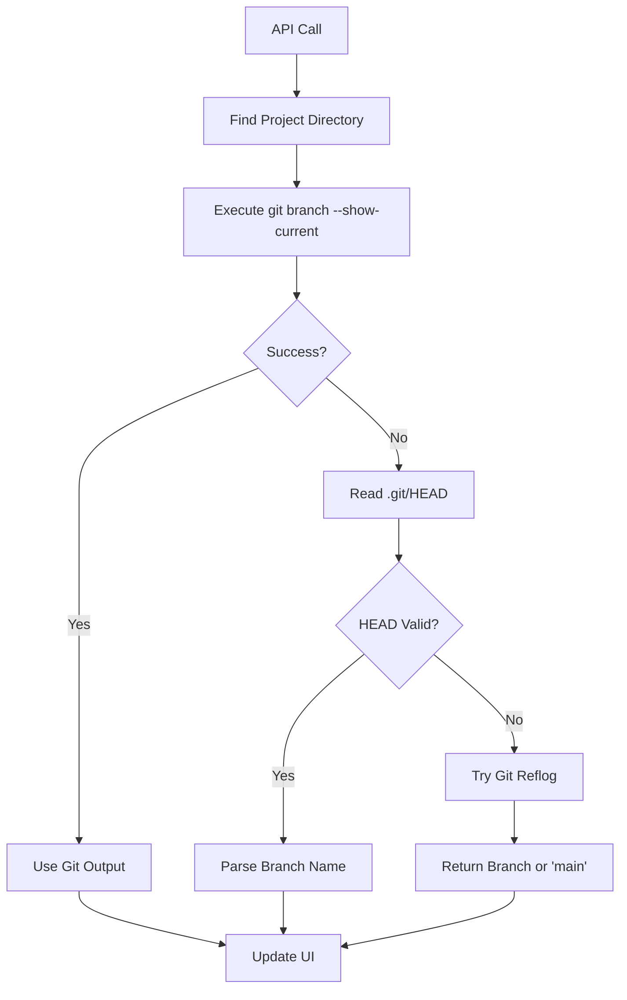

# 🔄 Branch Auto-Refresh & Detection Fix

## 🎯 Issues Addressed

**Before:**
- Current branch showed hardcoded `auto/20250722-143256` instead of actual `conv-rvy23a-step-2`
- UI was not updating to reflect real git branch changes
- Branch status was stale and required manual refresh

**After:**
- ✅ Real-time branch detection from actual git repository
- ✅ Auto-refresh every 30 seconds keeps UI in sync
- ✅ Multiple fallback mechanisms for reliable branch detection

## 🔧 Fixes Implemented

### 1. Enhanced Current Branch API
**File:** `src/app/api/projects/[projectId]/branches/current/route.ts`

**Changes:**
- **Direct Git Command Execution**: Replaced mock functions with real `git branch --show-current`
- **Intelligent Path Detection**: Automatically finds correct project directory
- **Multiple Fallback Methods**:
  1. Primary: `git branch --show-current`
  2. Fallback 1: Direct `.git/HEAD` file reading
  3. Fallback 2: Git reflog parsing for detached HEAD states

```typescript
// Example of the robust detection logic
try {
  const { stdout } = await execAsync('git branch --show-current', { cwd: projectPath });
  currentBranch = stdout.trim();
} catch (gitError) {
  // Fallback to .git/HEAD reading
  const headContent = fs.readFileSync(gitHeadPath, 'utf8').trim();
  if (headContent.startsWith('ref: refs/heads/')) {
    currentBranch = headContent.replace('ref: refs/heads/', '');
  }
}
```

### 2. Branch Store Auto-Refresh
**File:** `src/stores/branchStore.ts`

**New Features:**
- `refreshCurrentBranch(projectId)`: Gets actual current branch from API
- `startAutoRefresh(projectId)`: Starts 30-second interval refresh
- `stopAutoRefresh()`: Cleans up intervals

**Auto-refresh refreshes:**
- Current branch status
- Branch list
- Pending changes detection

### 3. Component Integration
**Files Updated:**
- `src/components/BranchManager/BranchManager.tsx`
- `src/components/LlmChat/hooks/useConversationBranches.ts`
- `src/components/LlmChat/hooks/useConversationMetadata.ts`

**Integration Points:**
- **BranchManager**: Auto-refresh starts on mount, stops on unmount
- **Conversation Branches**: Real-time branch updates in chat context
- **Conversation Metadata**: Branch info updates automatically

## 🚀 How It Works

### Auto-Refresh Lifecycle

1. **Component Mount**: Auto-refresh starts for active project
2. **Every 30 Seconds**: 
   - Calls `/api/projects/{projectId}/branches/current`
   - Updates current branch in store
   - Refreshes branch list and pending changes
3. **Component Unmount/Project Change**: Auto-refresh stops

### Branch Detection Flow



## 🎯 Expected Behavior

### Before Fix:
```
Current Branch: auto/20250722-143256  ❌ (hardcoded)
Last Updated: Never
```

### After Fix:
```
Current Branch: conv-rvy23a-step-2   ✅ (real-time)
Last Updated: Every 30 seconds
Auto-refresh: ✅ Active
```

## 🔍 Console Logs to Watch For

**Auto-refresh Starting:**
```
🔄 Starting auto-refresh for project rx461b (every 30 seconds)
🔄 Starting branch auto-refresh for project rx461b
```

**Branch Detection:**
```
🔍 Using project path: /Users/test/gitrepo/projects/rx461b_new-project
✅ Got current branch from git command: conv-rvy23a-step-2
🔍 Current branch for project rx461b: conv-rvy23a-step-2
```

**Auto-refresh Working:**
```
🔄 Auto-refreshing branch status for project rx461b
🔄 Auto-refreshing branches for project rx461b
```

## 🎉 Benefits

✅ **Real-time Accuracy**: UI always shows actual git branch  
✅ **Automatic Updates**: No manual refresh needed  
✅ **Multiple Contexts**: Works in BranchManager, Chat, and Metadata  
✅ **Robust Detection**: Multiple fallback methods prevent failures  
✅ **Clean Lifecycle**: Proper cleanup prevents memory leaks  

## 🧪 Testing

1. **Switch branches manually** via git command → UI updates within 30 seconds
2. **Create new conversation branches** → UI reflects changes automatically  
3. **Check different components** → All show consistent branch info
4. **Leave page and return** → Auto-refresh restarts correctly

Your branch status should now stay perfectly in sync with your actual git repository! 🚀 